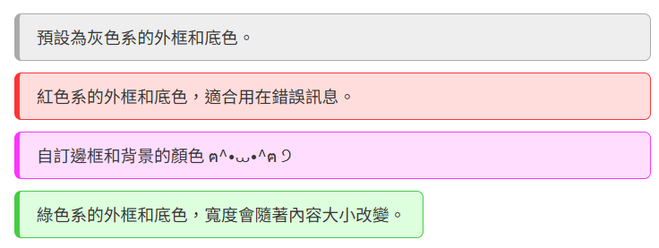

# Content - 內容區塊
文字方塊。

> [!TIP]
> 組件 `Content` 為全域組件，不須 `import` 即可直接使用。

## 範例
```vue
<template>
	<Content>
		預設為灰色系的外框和底色。
	</Content>

	<Content colorStyle="red">
		紅色系的外框和底色，適合用在錯誤訊息。
	</Content>

	<Content borderColor="#f3f" bgColor="#fdf">
		自訂邊框和背景的顏色 ฅ^⦁⩊⦁^ฅ ੭
	</Content>

	<Content colorStyle="green" collapsed>
		綠色系的外框和底色，寬度會隨著內容大小改變。
	</Content>
</template>

<style scoped>
div:not(:first-child) {
	margin-top: 10px;
}
</style>
```



## 組件參數
| `props.` | Type | Default | Description |
| :- | :- | :- | :- |
| `borderColor` | `string` | `#aaa` | 邊框顏色，記得要加 `#` |
| `bgColor` | `string` | `#eee` | 背景顏色，記得要加 `#` |
| `colorStyle` | `string` | `null` | 顏色風格：`gray \| blue \| red \| green`<br>若傳入的風格存在會覆蓋掉 `borderColor` 和 `bgColor` |
| `collapsed` | `Boolean` | `false` | 若為 `true`，<br>內容區塊的 `div` 的大小會隨著內部元素改變 |

### `colorStyle`
目前有四種顏色風格 `red`、`green`、`blue`、`gray`。

### `collapsed`
請參考上圖，上圖只有綠色區塊是 `true`，其他都為 `false`。
