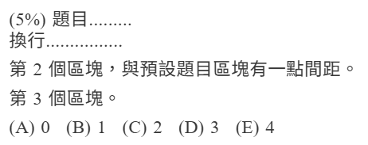
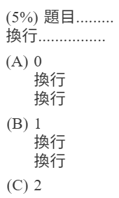

# MakeProblem - 題目模板
用於生成題目 vue 檔，維持樣式的一致性。

不一定要用這個組件編寫題目。

> [!TIP]
> 組件 `MakeProblem` 為全域組件，不須 `import` 即可直接使用。

> [!NOTE]
> 本組件會自動生成 `span.problem-score` 包裹配分，<br>
> 符合 [新增題本 Step 4-3](../exam-page/create-exam#step-4-3-編寫題目) 的規範。

## 範例 1
```html
<MakeProblem
	:score="5"
	:extraProblemSlotNames="[ 'prob-2', 'prob-3' ]"
	:optionSlotNames="[ 'A', 'B', 'C', 'D', 'E' ]"
>
	<template #problem>
		題目.........<br>換行................
	</template>
	<template #prob-2>
		第 2 個區塊，與預設題目區塊有一點間距。
	</template>
	<template #prob-3>
		第 3 個區塊。
	</template>
	<template #A>0</template>
	<template #B>1</template>
	<template #C>2</template>
	<template #D>3</template>
	<template #E>4</template>
</MakeProblem>
```


## 範例 2
```html
<MakeProblem
	:score="5"
	:optionSlotNames="[ 'A', 'B', 'C' ]"
	useUlToListOptions
>
	<template #problem>
		題目.........<br>換行................
	</template>
	<template #A>0<br>換行<br>換行</template>
	<template #B>1<br>換行<br>換行</template>
	<template #C>2</template>
</MakeProblem>
```


## 組件參數
| `props.` | Type | Default | Description |
| :- | :- | :- | :- |
| `score` | `Number` | `0` | 題目的配分 ( 大於 0 才會顯示配分 ) |
| `extraProblemSlotNames` | `Array<string>` | `[]` | 額外的題目區塊名 |
| `optionSlotNames` | `Array<string>` | `[]` | 選項的編號 |
| `useUlToListOptions` | `boolean` | `false` | 是否要以 `ul` 標籤顯示選項 |
