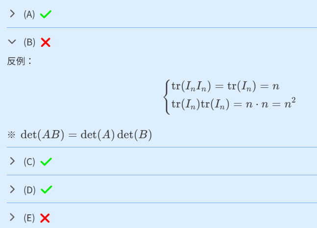

# MultiOption - 多選題
將每個選項的詳解摺疊起來，提升可讀性。



> [!TIP]
> 組件 `MultiOption` 為全域組件，不須 `import` 即可直接使用。

## 範例
```html
<MultiOption
	:optionNames="[ 'A', 'B', 'C', 'D', 'E' ]"
	:optionAnswers="[ true, true, false, false, null ]"
>
	<template #A>
		(A) 選項的詳解
	</template>
	<template #B>
		(B) 選項的詳解
	</template>
	<template #C>
		(C) 選項的詳解
	</template>
	<template #D>
		(D) 選項的詳解
	</template>
	<template #E>
		(E) 選項的詳解，不顯示答案
	</template>
</MultiOption>

<MultiOption
	:optionNames="[ 'opt1', 'opt2', 'opt3', 'opt4']"
>
	<template #opt1>
		(opt1) 選項的詳解，不顯示答案
	</template>
	<template #opt2>
		(opt2) 選項的詳解，不顯示答案
	</template>
	<template #opt3>
		(opt3) 選項的詳解，不顯示答案
	</template>
	<template #opt4>
		(opt4) 選項的詳解，不顯示答案
	</template>
</MultiOption>
```

## 組件參數
| `props.` | Type | Default | Description |
| :- | :- | :- | :- |
| `optionNames` | `Array<string>` | `[]` | 每個選項的編號 ( 會出現在括號內 ) |
| `optionAnswers` | `Array<Boolean>` | `[]` | 每個選項的答案 (`true` or `false`)<br>若不為 `Boolean` 會隱藏 icon |
