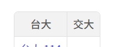
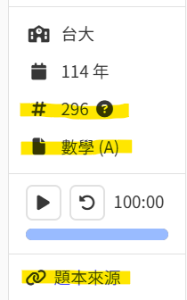
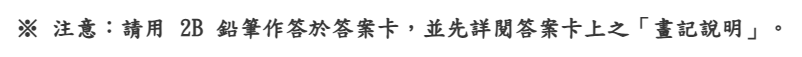
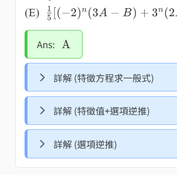
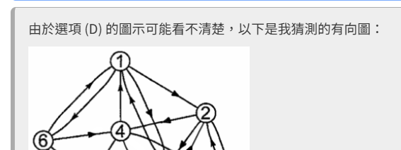

# 如何新增題本
目前只能透過 `git push` 上傳題本至 Ran。<br>
以下會詳細說明如何新增一個新題本。

## Step 1：設定學校與年份
開啟 `src/components/exam/config.json`，這個 `config` 用於設定學校的基本資訊和題本年份。

### Step 1-1：設定學校
如果新題本的學校英文縮寫不存在於 `uniList` 內，以下是新增方法：
```json
{
	"uniList": [ "ntu", "<學校英文縮寫>" ], // ← 插入
	"uni": {
		"ntu": {
			"name": "國立臺灣大學",
			"shortName": "台大",
			"yearList": [ "114", "113", "112" ]
		},
		// 新增 ↓
		"<學校英文縮寫>": {
			"name": "<學校中文全名>",
			"shortName": "<學校中文縮寫>",
			"yearList": []
		}
		// 新增 ↑
	}
}
```
| 資訊 | 說明 | 範例 |
| :- | :- | :- |
| 學校英文縮寫 | 學校的英文名稱縮寫 | `ntu`、`nycu` |
| 學校中文全名 | 學校全名 | 國立臺灣大學 |
| 學校中文縮寫 | 建議為 2 ~ 3 個字的全形中文 | 台大、台科大 |

#### 實際效果
其中 `uniList` 的排列順序會影響題本選單頁面內，表格橫軸的學校順序：


中文縮寫被 hover 時，會顯示學校中文全名。

### Step 1-2：設定年份
將新題本的民國年份 ( `string` ) 插入至 `uni.<學校英文縮寫>.yearList` 內，<br>
每個學校的 `yearList` 內的年份必須呈降序排列。

假設要新增交大某一年的題本：
```json
{
	"uniList": [ "ntu", "nycu" ],
	"uni": {
		"ntu": {
			"name": "國立臺灣大學",
			"shortName": "台大",
			"yearList": [ "114", "113", "112" ]
		},
		"nycu": {
			"name": "國立陽明交通大學",
			"shortName": "交大",
			"yearList": [ "114", "<新題本的年份>" ] // ← 插入
		}
	}
}
```

## Step 2：新增題本資料夾
新增一個資料夾 `src/components/exam/<學校英文縮寫>/<新題本的年份>/`，用於存放題本的資料。

假設要新增交大 112 年的題本，需要建立資料夾 `src/components/exam/nycu/112/`：
```diff
src/
└── components/
    └── exam/
        ├── ntu/
        │   ├── 112/
        │   ├── 113/
        │   └── 114/
+       └── nycu/
+           └── 112/
```

## Step 3：新增子目錄與題本設定檔
在題本資料夾新增這些東西：
```diff
  nycu/112/
+ ├── content/
+ ├── problem/
+ └── config.json
```

題本設定檔 `config.json` 內：
```json
{
	"id": "<題本的科目代號>",
	"subject": "<題本的科目，長度建議為 6 個全形字元內>",
	"link": "<題本來源的網址>",
	"linkTip": "<題本來源的網址的附註>",
	"section": [],
	"problem": {}
}
```

`id`、`subject`、`link`、`linkTip` 的值不一定要填。

> [!NOTE]
> 科目代號 `id` 和科目 `subject` 有可能會出現在題本內。<br>
> 不同科系類組的相同科目，科目代號會不一樣，為了避免混淆，建議提供科目代號。

#### 實際效果
會顯示在考卷頁面的側邊欄，題本來源連結被 hover 會顯示 `linkTip`。


## Step 4：新增題目
目前 Ran 的題目和詳解都是用 Vue 撰寫的，也許以後會支援 markdown。

接下來會講解如何新增題目至題本。

### Step 4-1：建立檔案
題目的檔名沒有限制。

將題目的 Vue 檔建立在題本資料夾內的子目錄 `problem/` 內。<br>
假設要新增 `3.vue` 這一題：
```diff
  nycu/112/
  ├── content/
  ├── problem/
  │   ├── -notice.vue
  │   ├── 1.vue
  │   ├── 2.vue
+ │   └── 3.vue
  └── config.json
```

### Step 4-2：在題本設定檔內新增題目
首先將檔名添加至題本設定檔內的 `section` 裡，<br>
假設要新增 `3.vue` 這一題：
```json
{
	...
	"section": [ "-notice", "1", "2", "3" ], // ← 插入 "3"
	"problem": { ... }
}
```

其中 `section` ( 區塊排列資訊 )，會決定題目的順序。<br>
上述的例子：由上至下依序顯示 `-notice.vue`、`1.vue`、`2.vue`、`3.vue`。

> [!IMPORTANT]
> 若檔名開頭包含 `-` 字符，會被視為題本的說明區塊。( 例如題本的作答說明或配分之類的 )<br>
> 而這一個「區塊」因為不是題目，所以不存在答案或詳解，<br>
> 因此接下來的 `problem config` 可以忽略，請直接跳至 [Step 4-3](#step-4-3-編寫題目)。<br>
> <br>
> 

接著在 `problem` 內新增題目 `3.vue` 的設定資訊：
```json
{
	...
	"section": [ "-notice", "1", "2", "3" ],
	"problem": {
		...
		"2": {
			"answerLatex": "\\text{A}",
			"content": [ ... ]
		},
		// 新增 ↓
		"3": {
			"answerLatex": "<這一題的解答 (LaTex 語法)>",
			"content": []
		}
		// 新增 ↑
	}
}
```

> [!TIP]
> 如果題目是選擇題，答案的 LaTex 語法建議用 `\\text{ABC}` 這個形式。

### Step 4-3：編寫題目
因為是使用 Vue 撰寫題目，雖然比較靈活，但沒有 markdown 簡潔。

介紹幾個全域 Vue 組件：
| 組件 | 說明 |
| :- | :- |
| [`MakeProblem`](../components/make-problem) | 題目模板 |
| [`vl`](../components/vl) | 顯示 LaTex 語法 |
| [`MultiOption`](../components/multi-option) | 多選題的折疊選項 |
| [`Content`](../components/content) | 顏色背景的 UI 區塊 |
| [`RanLink`](../components/ran-link) | 超連結 |

Ran 使用的 UI 框架：[Tocas UI](https://tocas-ui.com/5.0/zh-tw/)

> [!IMPORTANT]
> 為了要控制配分的顯示與否，題目的配分必須要用 `span.problem-score` 包起來。<br>
> 例：`<span class="problem-score">(10%)</span>`

## Step 5：新增題目的詳解或說明
詳解的製作方法與 [Step 4-3](#step-4-3-編寫題目) 相同。

### Step 5-1：建立檔案
詳解的檔名沒有限制。

將詳解的 Vue 檔建立在題本資料夾內的子目錄 `content/` 內。<br>
假設要新增第三題的詳解 `3-ans.vue`：
```diff
  nycu/112/
  ├── content/
  │   ├── 1-ans.vue
  │   ├── 2-ans.vue
+ │   └── 3-ans.vue
  ├── problem/
  └── config.json
```

### Step 5-2：在題本設定檔內新增詳解
需要在 `problem.<題目檔名>.content` 內，插入內容區塊的設定：
```json
{
	...
	"section": [ "-notice", "1", "2", "3" ],
	"problem": {
		...
		"2": {
			"answerLatex": "\\text{A}",
			"content": [ ... ]
		},
		"3": {
			"answerLatex": "<這一題的解答 (LaTex 語法)>",
			"content": [
				// 插入 ↓
				{ "type": "answer", "id": "3-ans", "suffix": "(選項逆推)" }, // 詳解類型的內容區塊
				// 插入 ↑
				{ "type": "default", "id": "3-note" } // 預設類型的內容區塊
			]
		}
	}
}
```

#### 詳解類型的內容區塊
生成一個藍色的摺疊式詳解。

添加 `{ "type": "answer", "id": "<檔名>", "suffix": "<後綴>" }` 至 `content`。

`suffix` 不是必填，效果如下：( 沒有 `suffix` 就只會顯示「詳解」兩字 )


#### 預設類型的內容區塊
生成一個灰色的內容區塊。

添加 `{ "type": "default", "id": "<檔名>" }` 至 `content`。



## 存放圖片
如果題目的 Vue 檔需要存放內部圖片，<br>
建議在 `problem` 和 `content` 內建立資料夾 `img`，然後將圖片放在裡面：( 這不是硬性規定 )
```diff
  nycu/112/
  ├── content/
+ │   └── img/
  ├── problem/
+ │   └── img/
+ │       └── xxx.webp
  └── config.json
```
