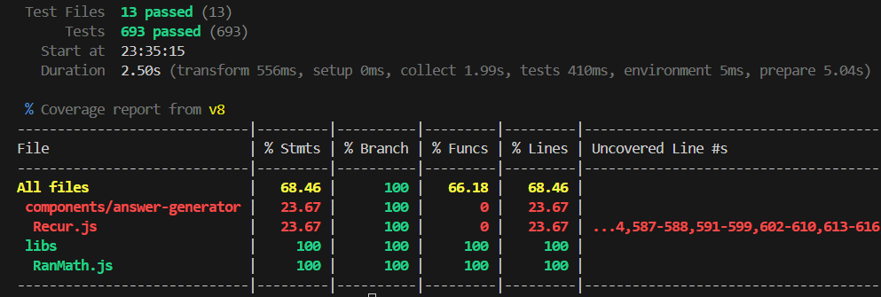

# 介紹
[`RanMath.js`](https://github.com/runnywolf/ran/tree/main/src/libs)
是一款很實用的數學函式庫，用於支援模擬室頁面的複雜數學運算。

提供了非常多的方法用於生成 LaTex 語法，可以使解答產生器變得容易實作。

## 如何使用
目前 `RanMath.js` 正在開發中階段，所以沒有上傳到 `npm`，也沒有 `min.js` 檔案。<br>
就... 直接複製到你想要的地方吧...

如果你用 `Vite` 開發，可以在 `vite.config.js` 設定路徑別名，<br>不然 `import { ... } from "ran-math"` 是無效的。
```js
export default defineConfig({
	...
	resolve: {
		alias: { // 路徑別名
			"@": "/src",
			"ran-math": "--- RanMath.js 的檔案路徑 ---" // 可以直接 import "ran-math"
		}
	},
	...
})
```

## 測試
`RanMath.js (v2.0.2)` 已通過測試，表中的 `Recur.js` 可以忽略，因為我懶得測。



```py
RanMath.js (v2.0.2) coverage report from v8

Functions: 137/137 (100%)
Branches:  511/511 (100%)
Lines:     882/882 (100%)
```

測試資料位於 [`src/tests/ran-math/`](https://github.com/runnywolf/ran/tree/main/src/tests/ran-math)，<br>
注意：有部分測試是 UI 測試，所以測試檔案是 `.vue`。

## 可能的目標 (想做但沒必要)
- 使用 `ts` 重寫 `RanMath.js`。
- 參數支援 `bigint`，不只是內部邏輯。
- 支援 `Multi Bases`： $\mathbb{Q}(\sqrt{-1}, \sqrt{2}, \sqrt{3}, \sqrt{5}, \cdots)$
- 支援 $\mathbb{Q}(\sqrt[n]s)$

就留給來到這裡的你吧 ~
